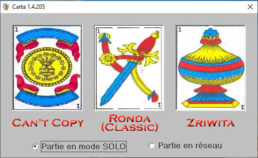
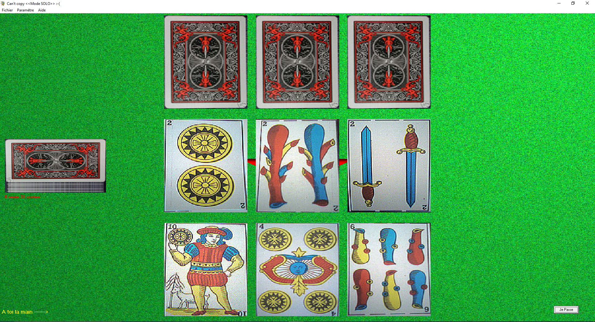
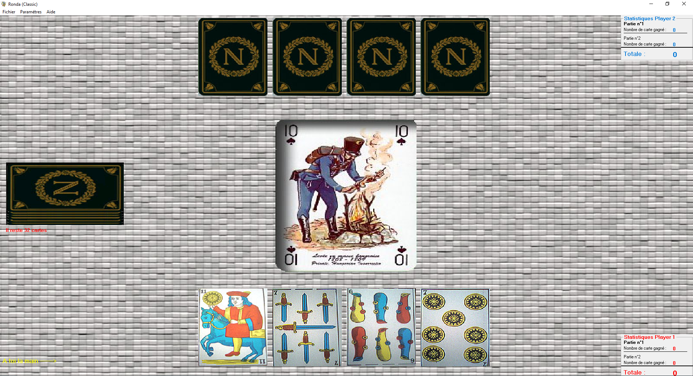
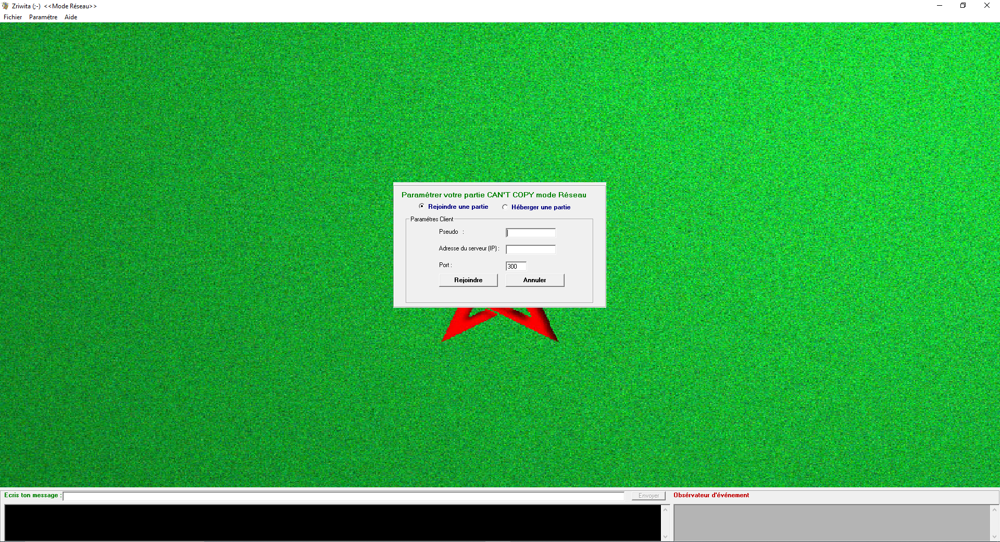

# Carta_V1.4.205

 

(1)

Jeu de carte v1 en VB6

Pour jouer en réseau il faut faire une redirection de port sur le routeur.

Need a port forwarding to use network.

Lost source code, only installer release is there.

https://github.com/melharfi/Carta_V1.4.205/releases/download/1.4.205/Carta_V1.4.205.exe
