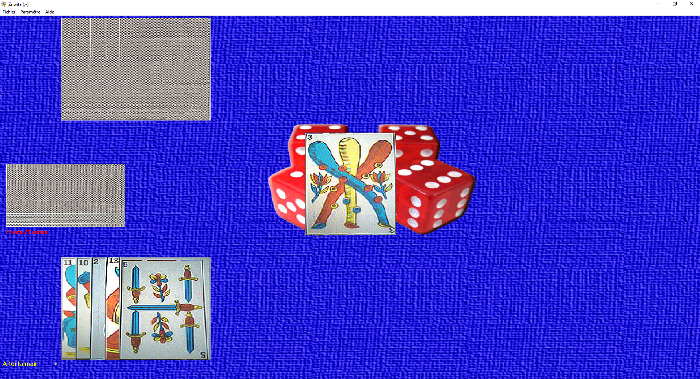

# Carta_V1.4.205
Jeu de carte v1 en VB6

Pour jouer en réseau il faut faire une redirection de port sur le routeur
Need a port forwarding to use network
Lost source code, only installer release is there
